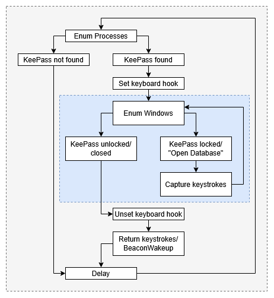
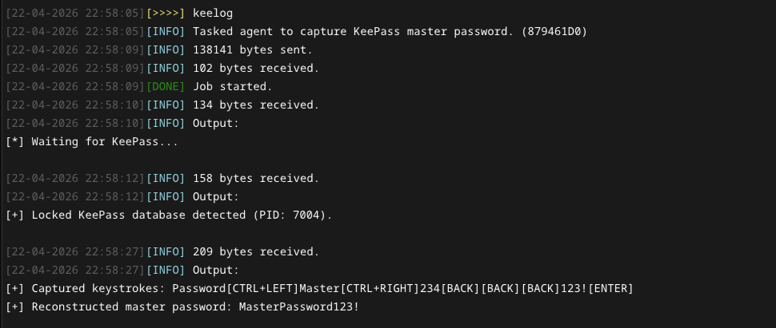

# KeeLog

Async BOF that captures the KeePass master password by monitoring for the unlock prompt window. When a locked KeePass database is detected, a low-level keyboard hook is installed and keystrokes are captured until the prompt window disappears by being submitted, cancelled or closeed. The captured buffer is then returned to the operator and automatically reconstructed into the master password.

>[!Important]
> This BOF requires asynchronous object file loading capabilitie to work without blocking the agent. Such functionality is provided by the [Conquest](https://github.com/jakobfriedl/conquest/) framework.

## How it works 

This BOF monitors the foreground window title to determine when the KeePass master password prompt is active. The title of the locked database window follows the format `Open Database - <database-name>.kdbx`, which distinguishes it from the unlocked state where the title is just `<database-name>.kdbx`. Keystrokes are logged when the locked database window is focused until it disappears.



## Usage

The KeeLog BOF does not require any arguments. This repository contains a [Conquest Module](./dist/keelog.py) which features an output handler that directly converts the raw keystrokes into the captured master password.



## Installation

```
git clone https://github.com/jakobfriedl/keelog-bof
cd keelog-bof
make
```

From there, use Conquest's Script Manager to load the `dist/keelog.py` module and start capturing master passwords using the `keelog` command. 